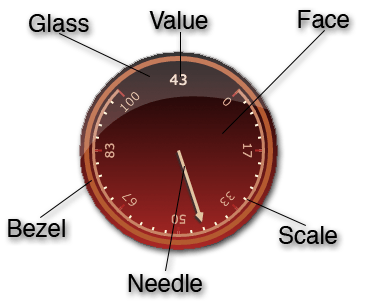

There are a lot of options to control the appearance of the dials and sliders. The options are segmented by the area of the dial they control.

The anatomy of a dial is as follows

The typescript definition of the options interface is:


/**
 *  Options to control the behaviour and styling of dials
 */
export interface DialOptions {
    type?:string;
    orientation?: string;

    x?: number;
    y?: number;
    width?: number;
    height?: number;
    baseRunOutSize:number;

    face: FaceOptions;
    value:ValueOptions;
    bezel:BezelOptions;
    glass: GlassOptions;
    needle:NeedleOptions;
    scale:ScaleOptions;
}



# Top level options

There are a number of top level options for the dial itself and then the aforementioned sub objects defining the face, value, bezel, glass, needle and scale options.

The top level properties of the dial options are:

*	`x`, `y`, `width`, `height`:	 
	*	No surprises here these set the position and size of the dial on the canvas. All of these are optional. If omitted the dial will scale to fill the entire canvas.
*	`type`:	 
	*	The optional type field sets the main look of the dial and can be one of the following
		*	`Dial360`
		*	`Dial180`
		*	`Slider`
		*	`Marquee` [^1]
	*	The default type is `Dial360`
*	`orientation`:	 
	*	The optional orientation field sets the direction of the dial. 
	*	The orientation can be one of the following
		*	`North` (or `N`)
		*	`South` (or `S`)
		*	`East` (or `E`)
		*	`West` (or `W`)
	*	The default orientation is `North`
*	`baseRunOutSize`:	 
	*	Used in the styling of 180 degree dials. Sets the size of the area at the bottom of the dial (for a north facing dial) where the value is placed
	* play with this setting only if you don't mind future updates hating you.

# Face options

The typescript definition of the `FaceOptions` interface is as follows



export interface FaceOptions{
    gradientColor1: string;
    gradientColor2: string;
}



This is hardly the most complex options class :-) The face of the dial is rendered as a gradient between two colors. The colors are any valid HTML 5 Canvas colors: _#rrggbb_, _rgb(r,g,b)_, _color names_ etc. Currently you cannot have an rgba color function, as transparency does not work.

Use the same color for both gradient colors to get a solid color face.

*	`gradientColor1`
	*	The lower gradient color [^2] 
*	`gradientColor2`	
	*	The upper gradient color [^2] 

You can have a play with these settings by hitting the 'try me' button below



    var x = $("#canvas").cDash({
      face: {
        gradientColor1: "black",
        gradientColor2: "#222222",
      }
    }).data("dbDashboard");

    x.value(50);


# Value options

The `ValueOptions` object controls the appearance of the value label as it appears on the dial face

The typescript interface definition for the Value object is:


    export interface ValueOptions {
        min: number;
        max: number;
        decimalPlaces: number;
        margin: number;
        font: FontOptions;    
    }


and the definition of the contained `FontOptions` interface is


    export interface FontOptions {
        family: string;
        pixelSize: number;
        strokeStyle: string;
        fillStyle: string;
    }


*	`min`	
	*	The minimum value the dial will display (default 0)
*	`max`	 
	*	The maximum value the dial will display (default 100)
*	`decimalPlaces`	 
	*	number of decimal places to display for the value (default 0)
*	`margin`	 
	*	pixel offset from ythe dial edge to the value
*	`font`	
	*	The definition of the font to use to render the value
		*	`family`	 The font family used to display the text
		*	`pixelSize`	The pixel size to use for the font
		*	`strokeStyle`	 The color[^2] to use for the text stroke
		*	`fillStyle`	 the color[^2]  to use for the text fill

If you want to experiment, here's an example with a non default value range and a value that is greater than the default maximum.



var x = $("#canvas").cDash({
  value :{
        min:32,
        max: 134,
        decimalPlaces:1,
        margin: 60,
        font: {
            family: "verdana",
            pixelSize:18,
            fillStyle: "white"
        }
    }
}).data("dbDashboard");

x.value(114);


On a final note, values are:

*	Clamped
	*	Values smaller than the minimum are rounded up to the minimum
	*	Values greater than the maximum are rounded down to the maximum
* 	Inclusive
	* minimim <= value <= maximum
*	Unfussy
	*	Don't worry if your minimum is greater than your maximum the control will swap them
	*	Trust me this does happen especially with negative bounds.

# Bezel options

The bezel is the band that runs around the dial. The typescript definition of the `BezelOptions` is:


    export interface BezelOptions {
        margin:number;
        width:number;
        strokeStyle: string;
        visible: boolean;
    }


The properties of the `BezelOptions` object are:

*	`margin`	 
	*	the distance from the dial edge to the center of the bezel
*	`width`	 
	*	the pixel width of the line that represents the bezel
*	`strokeStyle`	 
	*	the style[^2] to use to draw the bezel
*	`visible`	 
	*	a value indicating if the bezel should be visible or not (default true)

For your experimental pleasure you can play with the code below. Notice that as the bezel grows and shrinks the scale readjusts to fit


    var x = $("#canvas").cDash({
       bezel: {
            margin: 10,
            width: 10,
            strokeStyle: "white",
            visible: true
        }
    }).data("dbDashboard");

    x.value(66);


# Glass options

The `GlassOptions` interface specifies the style of the glass layer rendered over the top off all layers. It is a simple class whose interface is


       export interface GlassOptions {
        shape: string;
        visible: boolean;
    }


The properties of the GlassOptions class are:

*	`shape`	 
	*	There are two shapes that the glass can have. 
		*	`out` (default)  
		*	`inOut`
	*	These determine the shape of the highlight (experiment as always)	
*	`visible`	
	*	Gets a value indicating if the glass layer is visible


    var x = $("#canvas").cDash({
       glass: {
            visible: true,
            shape: "out"  // try "inOut"
        }
    }).data("dbDashboard");

    x.value(66);


# Needle options

The `NeedleOptions` interface for the dial  is


      export interface NeedleOptions {
        fillStyle:string;
        strokeStyle:string;
        strokeWidth:number;
        width:number;
        margin:number;
        shadowColor:string;
        shadowBlur:number;
        shadowX:number;
        shadowY:number;
        style: string;
    }


These properties have

*	`fillStyle`
	*	the fill style[^2] of the needle
*	`strokeStyle`	 
	*	stroke style[^2] for the needle stroke
*	`strokeWidth` 
	*	stroke width for the line around the needle
*	`width`
	*	the width of the needle (very subjective to dial type, experiment with the number)
*	`margin`
	*	The margin from the inside edge of the bezel (again experiment dials are different to sliders)
*	`shadowColor`	 
	*	the fill color[^2] for the shadow
*	`shadowBlur`
	*	the blur radius
*	`shadowX`
	*	X offset in pixels for the shadow
*	`shadowY` 
	*	Y offset in pixels for the shadow
*   `style`
    *   The visual style of the needle can be one of 
        *   `triangle`
        *   `arrow`
        *   `line`
        *   `circleArrow`
        *   `dart`
        *   `dot`

If you change the style of needle you may well need to alter the scale and needle margins to get visually pleasing results. The different canned themes use different styles of needles and of course you should experiment in the [Theme Park](/themePark)

Here's some code to try out


    var x = $("#canvas").cDash({
       needle: {
         fillStyle:"black",
        strokeStyle:"white",
        strokeWidth:1.5,
        width:5,
        margin:10,
        shadowColor:"#eeee",
        shadowBlur:3,
        shadowX:2,
        shadowY:2,
        }
    }).data("dbDashboard");

    x.value(66);


# Scale options

[^1]: I'll cover Marquees in a separate post.
[^2]: colors are any valid HTML 5 Canvas colors: _#rrggbb_, _rgb(r,g,b)_, _color names_ etc. Currently you cannot have an rgba color function, as transparency does not work
